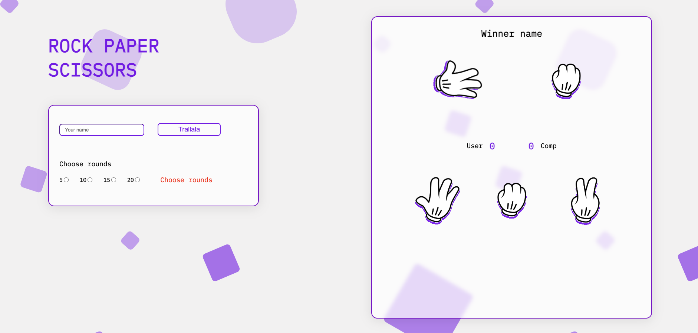

#🚀 Projektübersicht

Dieses Projekt bietet eine einfache, aber unterhaltsame Umsetzung des traditionellen Spiels Schere-Stein-Papier. Das Spiel ermöglicht es dem Benutzer, seine Züge auszuwählen und gegen eine zufällige Entscheidung des Computers anzutreten.

Der aktuelle Stand des Projekts ist noch in Entwicklung, jedoch sind bereits folgende Funktionen implementiert:

- Rundenauswahl möglich
- Auswahl zwischen Stein, Papier und Schere
- Anzeige der aktuellen Spielstände
- Rundenbasierte Spiellogik
- Restart-Funktion: Möglichkeit, das Spiel neu zu starten

##📸 Screenshots
Spielansicht:

  

##🛠️ Technologien
Das Spiel wurde mit den folgenden Technologien erstellt:

- HTML5: Struktur der Webseite
- CSS3: Styling und Layout
- TypeScript: Spiellogik und Interaktivität

- Bestimmung des Siegers jeder Runde

##🔜 Geplante Features
- Endauswertung: Anzeige des Gesamtsiegers nach den Runden
- Responsive Design: Optimierung für mobile Geräte